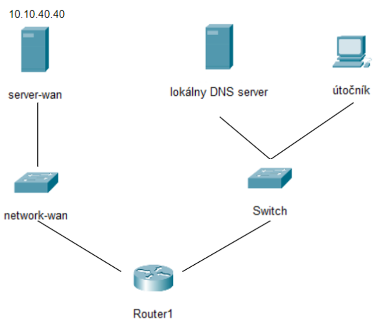
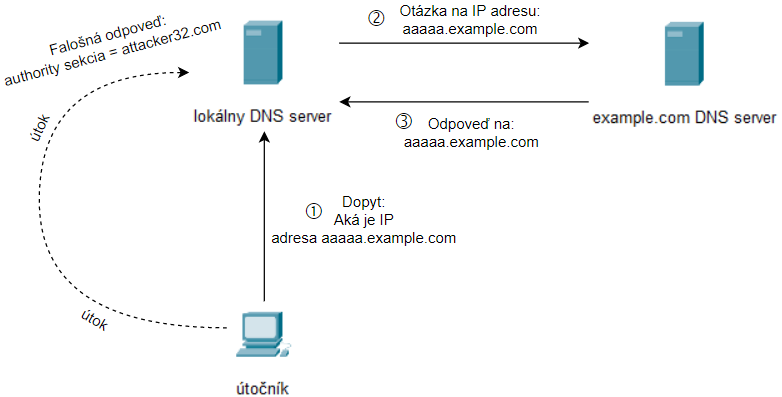

# bp-Remote_cache_poisoning

Tu si môžete stiahnuť virtuálne počítače a prostriedky, ktoré potrebujete na spustenie vzdialeného útoku na otravu vyrovnávacej pamäte.

## Úvod
Cieľom tohto labu je, aby študenti nadobudli prvé skúsenosti s útokom na otravu vzdialenej vyrovnávacej pamäte DNS, ktorý sa nazýva aj útok Dana Kaminského. Na obrázku môžete vidieť, že toto laboratórium obsahuje 4 virtuálne stroje. Prvý je router, druhý je lokálny DNS server (obeť), tretí je útočník (vy) a posledný je server-wan (autoritatívny menný server pre doménu example.com). Vašou úlohou je otráviť vyrovnávaciu pamäť lokálneho DNS servera za pomoci falošnej odpovede.

## Ako funguje vzdialené otrávenie vyrovnávacej pamäte
V skutočnom svete nie sú útočník a lokálny server DNS v rovnakej sieti. Útočník tým, že nepočúva komunikáciu, nepozná zdrojovú IP adresu, cieľové číslo portu a ID transakcie. Tieto tri informácie sú pre útočníka kritické, ak chce, aby bol útok úspešný. Treba však vyriešiť dva skutočné problémy.   
*Poznámka:*  
V tomto labe je len pre jednoduchosť útočník a lokálny DNS server. Hráč nemá povolené použiť metódy na odchytávanie premávky a následne použitie týchto informácií na vykonanie tohto cvičenia.
##### Prvým problémom je načasovanie
Pri lokálnom útoku útočník vie odpočúvať komunikáciu a zachytávať pakety, takže presne vie kedy bol paket odoslaný. Pri vzdialenom útoku takúto možnosť útočník nemá. Tento problém sa však dá ľahko vyriešiť. Aby útočník vedel, kedy má poslať falošné odpovede, on sám odošle požiadavku na lokálny DNS server a spustí útok ktorým zaplaví lokálny DNS server falošnými odpoveďami.
##### Druhým problémom je vyrovnávacia pamäť lokálneho servera DNS
Ak útok nie je úspešný a legitímnemu mennému serveru sa podarí odpovedať, odpoveď sa uloží do vyrovnávacej pamäte. Ak by útočník pokračoval tak daný útok by už nemal zmysel pretože v ďalšom pokuse sa už nevyšle žiadny dopyt na menný server ale lokálny DNS server zoberie odpoveď zo svojej vyrovnávacej pamäte. Útočník by musel teda počkať kým vyprší TTL aby sa daný záznam stal neplatným. V takom prípade by lokálny DNS server musel odoslať znova požiadavku a útočník by mal príležitosť na vykonanie útoku ale opäť len jeden pokus. Ak by sa to nepodarilo musel by opäť čakať na vypršanie TTL, mal jeden pokus a takto stále dookola. Kým vyprší TTL môžu prejsť aj dni. Preto ak by mal útočník vždy len jednu príležitosť za niekoľko dni, napríklad dva či tri, tak samotný útok na to aby prebehol úspešne by musel trvať desiatky či stovky rokov. Z tohto dôvodu bol vzdialený útok v praxi nerealizovateľný 

#### Útok Dana Kaminského
Dan Kaminsky prišiel s veľmi šikovným nápadom. Namiesto toho, aby sa útočník stále opýtal jednu otázku (napr. stuba.sk), opýta sa inú, napríklad a.stuba.sk. S najväčšou pravdepodobnosťou útočník prehrá a lokálny DNS server dostane legitímnu odpoveď zo skutočného menného servera. Ak meno na mennom servery neexistuje, lokálny DNS server dostane odpoveď že meno neexistuje a uloží si túto informáciu do vyrovnávacej pamäte. Takže a.stuba.sk bude uložená do vyrovnávacej pamäte, či už so skutočnou IP adresou alebo so záznamom, ktorý hovorí že toto meno neexistuje. To je v poriadku pretože útočník sa neopýta znova tú istú otázku ale teraz odošle b.stuba.sk. Ak sa aj ten záznam uloží do vyrovnávacej pamäte útočník stále môže pokračovať, c.stuba.sk, d, e, f atď. Vždy sa opýta inú otázku čiže odpoveď na ňu nebude uložená vo vyrovnávacej pamäti. Lokálny DNS server bude musieť odosielať požiadavky a útočník teda nemusí čakať kým by záznamu vo vyrovnávacej pamäti vypršal TTL. Pri tomto útoku sa útočník zámerne nezameriava na sekciu odpovedí. Dôležitá je sekcia autority. Ak je útok úspešný, menný server útočníka sa uloží do vyrovnávacej pamäte na lokálnom DNS serveri ako autorita pre doménu. V tomto bode je vyrovnávacia pamäť infikovaná a doména je napadnutá útočníkom.

## Inštalácia CSC
Ak si chce používateľ zahrať túto hru je potrebné si nainštalovať prostredie sandboxu a nastaviť softvér. Táto inštalácia je opísaná na stránke od kolegov z Masarykovej univerzity v Brne https://gitlab.ics.muni.cz/muni-kypo-csc/cyber-sandbox-creator/-/wikis/3.0/Installation - časť Chcem spustiť CSC sandbox.

## Inštalácia
Najprv musíte skopírovať toto úložisko do počítača. Po stiahnutí prejdite do priečinka kde ste si tento repozitár stiahli a prejdite do priečinka **muni-kypo_VMs**. Spustite tento príkaz:
 
*create-sandbox --provisioning-dir ./provisioning ./remote.yml*
 
toto by malo vytvoriť prechodnú definíciu sandboxu. Prejdite do priečinka **sandbox** a spustite tento príkaz:
 
*manage-sandbox build*
 
po chvíli sa vo virtual boxe zobrazia tri virtuálne stroje - router, server-lan a útočník.
 
Teraz musíte vytvoriť posledný - Local_DNS_server. Prejdite do priečinka **vagrant_VMs/server**, ktorý sa nachádza v stiahnutom priečinku. Spustite tento príkaz:
 
*vagrant up*
 
po chvíli by ste mali vo virtuálnom boxe vidieť Local_DNS_server. Prvýkrát tento stroj vypnete a znova zapnete. Je to dôležité, pretože toto zariadenie sa na prvýkrát nepripojí k sieti.

## Úlohy
Najprv musíte spustiť bash skript na Local_DNS_server. Otvorte terminál na Local_DNS_server a spustite check_attacker.sh.  
`./check_attacker.sh`  
Tento skript vypíše vyrovnávaciu pamäť Lokálneho DNS servera každých 60 sekúnd a skontroluje či je útočníkov menný server vo vyrovnávacej pamäti a teda či bol samotný útok úspešný.   
**Pozor**  
Po 30 minútach sa obnovia pravidlá firewallu a daný útok už nebude možné uskutočniť! Vy (útočník) máte teda len necelých 30 minút kým si administrátor serveru všimne chybu v konfigurácii a zablokuje vašu IP adresu čo bude mať za následok že útoku už nebude následne možné uskutočniť. 
*Poznámka:* Ak sa vám nepodarí vykonať útok v stanovenom čase bude potrebné daný virtuáln stroj opäť vrátiť do pôvodného - "zraniteľného" stavu. Lokálny DNS server VM bude preto potrebné zničiť a nanovo vybuildovať. **
  
Na útočnom stroji:  
Prihlasovacie údaje sú kali:kali.
1. Zisti svoju IP adresu.  
    `ip addr`
2. Spustite bezpečnostný skener portov - nmap. Jednak tým overíte či sa lokálnemu DNS serveru podarilo pripojiť do siete, ale aj zistíte IP adresy jednotlivých zariadení (budú sa vám neskôr hodiť)
    

    
Spoiler!

     
        `sudo nmap -sn <your_IP_addr/range>`
     
    

    
    ! *POZNÁMKA: Lokálny DNS server sa nachádza v rovnakej sieti ako aj tvoj (útočníkov) počítač.*

3. Prejdite do adresára remote_repo. V tomto adresári sú zobrazené všetky súbory a prostriedky, ktoré budete potrebovať na to aby bol útok úspešný.  
    `cd remote_repo`
4. Skopírujte obsah _etc_bind_attacker+example do /etc/bind/named.conf. Týmto vytvoríte dve zóny na serveri DNS. Oba tieto súbory zóny sa použijú na iteratívne vyhľadávanie (názvu hostiteľa na IP adresu).  
    *príkazy napríklad:*  
    `cat _etc_bind_attacker+example` -> skopírujte obsah súboru  
    `sudo vi /etc/bind/named.conf` -> vložte obsah do tohto súboru
5. Skopírujte attacker.com.zone do priečinka /etc/bind. Tento záznam slúži pre iteratívne vyhľadávanie domény attacker32.com. Tu je uložené rozlíšenie DNS. Čitatelia, ktorí sa zaujímajú o syntax súboru zóny, si môžu pozrieť podrobnosti v RFC 1035.  
    `sudo cp attacker.com.zone /etc/bind/`
6. Skopírujte example.com.zone do priečinka /etc/bind. Tento záznam slúži pre iteratívne vyhľadávanie domény example.com (samozrejme tento záznam je falošný). Bol vytvorený pre vás (útočníka) a má za následok že keď bude vyrovnávacia pamäť Lokálneho DNS servera otrávená tak s ním budete vedieť komunikovať - odpovedať mu na jeho dopyty.  
    `sudo cp example.com.zone /etc/bind/`
7. Reštartujte službu bind9 a skontrolujte či je služba bind9 spustená. Pri každej zmene konfigurácie DNS je potrebné reštartovať server DNS.  
    `sudo systemctl restart named`  
    `sudo systemctl status named` -> ak si ste spravili všetko dobre status by mal byt *running*  
8. Doplňte chýbajúce miesta v súbore request.py, spravte súbor request.py spustiteľným a spustite súbor request.py. Na úpravu tohto súboru použite svoj obľúbený textový editor (vyplňte miesta na ktorých sú hviezdičky) 
    

    
Spoiler!

     
        ip = IP(dst='&lt;ip_addr Local_DNS_server&gt;', src='&lt;ip_addr attacker&gt;')  
        udp = UDP(dport= &lt;DNS&gt; , sport= &lt;any between 1024-65535&gt;, chksum=0)
     
    

    
    `sudo chmod +x request.py` -> urobte ho spustiteľným  
    `sudo ./request.py` -> spustiť  a potom po spustení skriptu python vo vašom priečinku sa zobrazí nový súbor bin. Tento súbor bin bude použitý kódom C na generovanie falošnej DNS požiadavky (dotazu).  

Teraz ste vytvorili falošný DNS dopyt. Ten sa odošle na lokálny DNS server. Lokálny DNS server však nebude vedieť na tento dopyt odpovedať, preto vytvorí dopyt kde bude požadovať odpoveď na vašu otázku. Tento dopyt sa následne odošle na server-wan - autoritatívny menný server pre doménu example.com. Vašou úlohou bude v ďalšom kroku vytvoriť falošnú odpoveď na dopyt lokálneho DNS servera. 
    
9. Doplňte chýbajúce miesta v súbore reply.py, nastavte súbor reply.py na spustiteľný a spustite súbor reply.py. Na úpravu tohto súboru použite svoj obľúbený textový editor (vyplňte miesta označené hviezdičkami - nastavenia lokálneho DNS servera som upravil tak aby DNS dopyty posielal a teda aj prijímal na porte 33333, *domain* značí doménu na ktorú útočíte, *ns* je útočníkov menný server - pozri attacker.com.zone pre správne doplnenie NS) a potom  
    

    
Spoiler!

     
        domain = 'example.com' -> pretože na tú útočíte  
        ns = 'ns.attacker32.com' -> menný server (NS) attacker32, útočníkov    
         
        ip = IP(dst='&lt;ip_addr Local_DNS_server&gt;', src='&lt;ip_addr server-wan&gt;')  
        udp = UDP(dport= &lt;33333&gt; , sport= &lt;DNS&gt;, chksum=0)
     
    

    
    `sudo chmod +x reply.py` -> urobte ho spustiteľným  
    `sudo ./reply.py` -> spustiť   
    po spustení skriptu python vo vašom priečinku sa zobrazí nový súbor bin. Tento súbor bin bude použitý kódom C na generovanie falošnej DNS odpovede.  
10. Kompilujte attack.c. Ak použijete príkaz uvedený nižšie, zostavený súbor bude mať názov *a.out*. Tento kód funguje nasledovne:  
   Použije request.bin na vygenerovanie dopytu v ktorom náhodne vymieňa prvých 5 písmen v názve (kvôli tomu aby sme sa nepýtali stále tú jednu otázku) na ktorú útočník následne odpovie 50krát, používa reply.bin, pričom pre každú z 50 odpovedí generuje náhodné TransactionID.  
    `sudo gcc attack.c`
11. Spustite skompilovaný súbor (nezabudnite ho spustiť ako sudo). Je to dôležité, pretože ak ho nespustíte ako sudo, virtuálny stroj nemusí odosielať pakety.  
    `sudo ./a.out`  

**Výsledok**  
Teraz prejdite na stroj Local_DNS_server a sledujte výstup spusteného skriptu, ktorý ste spustili na začiatku. Ak ste správne doplnili python kódy a spustili C kód, mali by ste vidieť správu "Útok bol úspešný" a taktiež aj záznam NS attacker32.com. Následne po prejdení 30 minútach od spustení hry servera môžete skontrolovať obranu. Mali by ste už len stále dostávať správu "Ak nevidíte výsledok, útok ešte nebol úspešný".

**
Stretnete sa s problémom kedy vám vagrant bude vypisovať že daný názov virtuálky už vo VB existuje, preto bude potrebné vymazať daný súbor v priečinku VB a až potom bude možné opätovne vybudovať lokálny DNS server VM príkazom - *vagrant up*.    

## Zdroje
https://seedsecuritylabs.org/Labs_16.04/PDF/DNS_Remote_new.pdf
